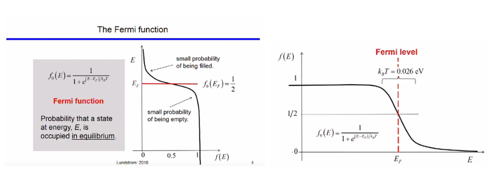
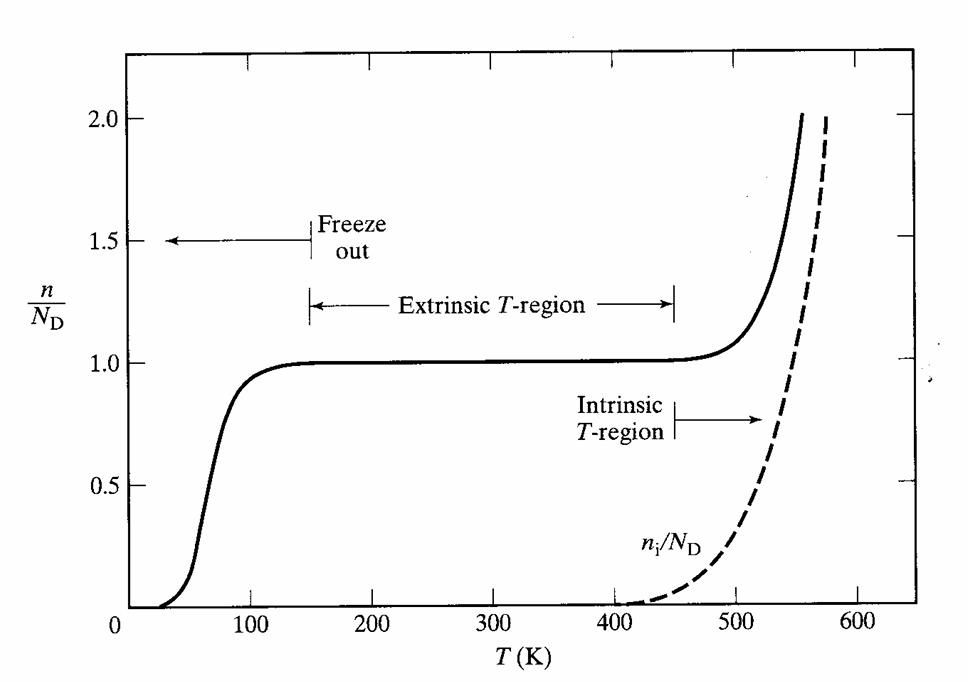

## Fermi Level
The fermi function gives the probability of a state being occupied at equilibrium by an electron. The equation defining the probability vs energy at temperature T is given by the equation,

$$
f_o(E) = \frac{1}{1+e^{E-E_{f}/k_{B}T}} \tag{3.1}
$$

where
<b>fo(E)</b> is the fermi function for a given energy level,  
<b> Ef </b> is the fermi level,  
<b> kB </b> is the Botzmann's constant whose value is 1.38* 10-23 J/K and  
<b> T </b> is the temperature. 

The fermi level is the energy for which the probability of electron occupying the state is 1/2

$$
f_{o}(E) = \frac{1}{2}\tag{3.2}
$$

In other words, states above the fermi level have a low probability of being empty and the states below the fermi level have a low probability of being filled.

 

At 0 K, the particles (electrons) are at the lowest energy state. Hence, all states with energy below Fermi Level (E < Ef) are completely occupied (Probability = f(E) = 1). All states with E > Ef are unoccupied (f(E)=0). With increase in temperature, thermal energy is gained by the particles. Hence, particles move from states below the fermi level to the states above the fermi level. As a result the Fermi level function plot 'spreads' out more and more as the temperature increases.

## Electron Density and Hole Density
Number of electrons per c.c. in the conduction band at energy  
$$
E \quad(i.e. \quad between \quad E \quad & \quad E+dE) \quad = g_{c}(E)f(E)dE
$$
where 
$$
E \geq E_{c}\tag{3.3}
$$
and gc(E)f(E)dE corresponds to the density of states in the conduction band.

$$
n = \int_{E_{c}}^{\inf} g_{c}(E)f(E)dE \tag{3.4}
$$
This can be approximated for
$$
E_{C} - E_{F} \geq 3kT\tag{3.5}
$$
by,
$$
n = N_{C}e^{E_{f}-E_{C}/k_{B}T}\tag{3.6}
$$

Here, NC is the effective density of states in the conduction band.
$$
N_{C} = 2(\frac{m^{*}_{n}k_{B}T}{2\pi\hbar^{2}})^{3/2} \tag{3.7}
$$

Number of holes per c.c. in the valence band at energy  
E(i.e. between E & E+dE) = gv(E)[1-f(E)]dE
where 
$$
E \leq E_{v} \tag{3.8}
$$

$$
p = \int_{-inf}^{E_{v}} g_{v}(E)[1-f(E)]dE \tag{3.9}
$$
This can be approximated for
$$
E_{F} - E_{V} \geq 3kT \tag{3.10}
$$
by,
$$
p = N_{V}e^{E_{V}-E_{f}/k_{B}T} \tag{3.11}
$$

where, Nv is the effective density of stes in the valence band
$$
N_{V} = 2(\frac{m_{v}^{2}k_{B}T}{2\pi \hbar^{2}})^{3/2} \tag{3.12}
$$

For an intrinsic material(not doped), the electron concentration is,
$$
n_{i} = N_{C}e^{E_{i}-E_{C}/k_{B}T} \tag{3.13}
$$
and the hole concentration is
$$
n_{i} = N_{V}e^{E_{V}-E_{i}/k_{B}T} \tag{3.14}
$$

Therefore,
$$
n = n_{i}e^{E_{f}-E_{i}/k_{B}T} \tag{3.15}
$$
and
$$
p = n_{i}e^{E_{i}-E_{f}/k_{B}T}\tag{3.16}
$$

## Equilibrium Carrier Densities
Equilibrium: A system is said to be in equilibrium, if no external inputs have been applied and the system is in a steady state. In other words, there are no net internal currents or carrier gradients in the system if left unperturbed 
Equilibrium carrier densities refer to the number of carriers in the conduction and valence band with no externally applied bias. The electron densities are calulated by counting and adding up all the filled states. Hence, product of fermi function and DOS(Density of States) (refer to the  <a href="https://virtual-labs.github.io/exp-dos-fermi-iiith/"> previous experiment</a> for details), is taken and integrated for the required energy range. Similarly for holes, Integrating product of probability of state being empty (1-f(E)) and 
density of states for given energy range gives holes concentration.

## Equilibrium Carrier Density Product 
If no and po are the equillibrium concentration of elevtrons and holes respectively, the product is obatined by multiplying electron and hole concentrations
$$
n_{o}p_{o} = N_{C}e^{E_{F}-E_{C}/k_{B}T} \cdot N_{V}e^{E_{V}-E_{F}/k_{B}T} \tag{3.17}
$$

$$
n_{o}p_{o} = N_{C}N_{V} e^{E_{V}-E_{C}/k_{B}T} \tag{3.18}
$$

The carrier product in the left-hand-side of th ebove equation is the intrinsic(undoped) silicon carrier concentration ni and as we know bandgap energy 
$$
E_{G} = E_{C} - E_{V} \tag{3.19}
$$
Hence,
$$ 
n_{i} = \sqrt{N_{C}N_{V}} e^{-E_{G}/2k_{B}T}\tag{3.20}
$$

We also obtain,
$$
n_{i}^{2} = n_{o}p_{o}\tag{3.21}
$$
This equation describes the law of mass action and relates the carrier concentration in doped semiconductor to intrinsic semiconductor.

## Intrinsic Fermi level 
For an n-type semiconductor, the fermi level is Between the intrinsic level(Ei) conduction band (EC). The number of electrons in the conduction band is much larger and donor band energy(ED) is closer to the conduction band. Similarly, the fermi level of a p-type semiconductor is between (Ei) valence band (EV) . The number of holes in the valence band is much larger and acceptor band energy ((EA)) is closer to valence band.

We found that the electron density can be written as-
$$
n_{o} = N_{C}e^{E_{F}-E_{C}/k_{B}T}\tag{3.22}
$$

and the hole concentration can be written as-

$$
p_{o} = N_{V}e^{E_{V}-E_{F}/k_{B}T} \tag{3.23}
$$

For an intrinsic semiconductor,

$$
n_{o} = p_{o} = n_{i} \tag{3.24}
$$

or, 
$$
N_{C}e^{E_{F}-E_{C}/k_{B}T} = N_{V}e^{E_{V}-E_{F}/k_{B}T}\tag{3.25}
$$

Solving for EF = Ei(the intrinsic fermi level)

$$
E_{i} = \frac{E_{C} + E_{V}}{2} + \frac{k_{B}T}{2} ln(\frac{N_{V}}{N_{C}}) \tag{3.26}
$$

We find that the fermi level is not right in the middle of the conduction and the valence band and that there is an additional correction factor. This correction depends on the effective densities of states in the valence and conduction bands.
$$
E_{i} = \frac{E_{C} + E_{V}}{2} + \frac{3k_{B}T}{4} ln(\frac{m*_{p}}{m*_{n}}) \tag{3.27}
$$

## Doping Density
In a uniformly doped semiconductor, the net charge is zero(doped with neutral atoms). This is called charge neutrality.

$$
\rho = q [p - n + N_{D}^{+} - N_{A}^{-}] = 0 \tag{3.28}
$$

Dopant concentration is ND and acceptor concertation is NA. Ideally all the dopant atoms ionize and contribute electron/hole for conduction leaving behind a charged center. Let the ionized latter’s concentration be ND+ or NA- 
The total carrier concentration is always represented by 𝑛 for free electrons and 𝑝 for free holes. Intrinsically electron-hole pairs are formed maintaining charge neutrality. 

## Ionisation of Dopant and Temperature Dependence

Ionisation of dopant with increase in temperature is shown below. At 0K, there is no ionization of the dopant impurities nor of any Silicon atom, as a result the semiconductor has almost zero carriers (called Freeze Out). As temperature increases slowly 0-100 K, only the dopant impurities start ionizing and result in an increase in number of carriers until all dopants are ionized (n=N_D) (100K < T < 400K). Contribution by silicon atoms is not much at these temperatures. However, at much higher temperatures (T >400 K), silicon also starts to generate large number of electron hole pair and total carrier concentration increases drastically. This is shown by region marked as ‘intrinsic 
region.

 
