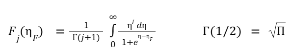
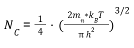
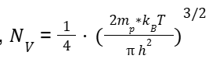
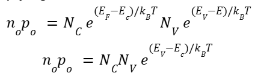
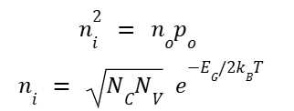
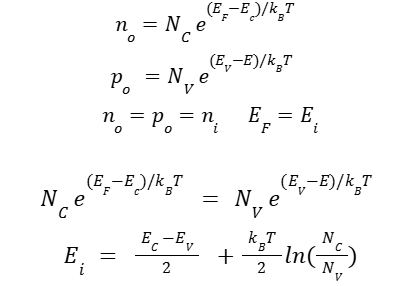
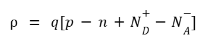

## Fermi Level
The fermi function gives the probability of a state(if it exists) being occupied at equilibrium.

fo(E) = 1 / [1 + e(E + Ef) / kBT]

The parameters of the function are, fo(E) and T.

It also describes the electron density in the conduction band and the hole density in the valence band.

The fermi level is the value of Ef when the fermi function equates to ½, i.e.

fo(E) = 1/2

States below the fermi level have a low probability of being empty and the states above the fermi level have a low probability of being filled.

 

The width of the transition depends on temperature. The transition between high probability and low probability states increases with increase in temperature.

## Equilibrium Carrier Densities
Equilibrium carrier densities refer to the number of carriers in the conduction and valence band with no externally applied bias. A nondegenerate semiconductor is a semiconductor whose conduction band level is much higher than the fermi-level and whose valence band level is much lower than the fermi-level. In a non degenerate semiconductor, the probability of the state at the bottom of the conduction band can be approximated to e(Ef - EC) / kBT. Therefore, n, the electron density, is proportional to this value. Similarly, the probability of the state at the top of the valence band can be approximated to  e(EV + Ef) / kBT. Therefore, p, the electron density, is proportional to this value.

n  ∝  e(Ef - EC) / kBT

p  ∝  e(EV + Ef) / kBT

Where,
n is electron density at the the bottom of the conduction band
p is the electron density at the top of the valence band
Ef is the fermi level
EC is the fermi energy of the conduction band 
EV is the fermi energy of the valence band 

## Electron Density in the Conduction Band
The number of electrons in a region can be calculated as the product of the number of states in that region and the fermi function(gives probability of those states being occupied). 

no = fo(E)DC(E) dE

fo(E) = 1/(1+e(E + Ef) / kBT)

Dc = ((2m*)3/2 / 2π2h3) √(E - EC)

 
To calculate the electron density in the conduction band,

no = ECno(E) dE = ECo(E)DC(E) dE

This can be approximated to 

no = NC F1/2(&#951;F)

Here F1/2 is the fermi-dirac integral. Where

For a nondegenerate semiconductor, 
dFj d&#951;F;= Fj+1  
Therefore, F1/2(F) can be approximated to eF for nondegenerate semiconductors.
no = NC e&#951;F
Where,   and F = (EF + EC) / kBT 

## Hole Density in the Valence Band
Similar to electron density, hole density is found to be the product of the number of states in that region and the fermi function(gives probability of those states being occupied).

po = NV e&#951;F 

Where,   and F = (EV - EF) / kBT 

## Equilibrium Carrier Density Product 
This can be found by multiplying electron and hole concentrations

 
This expression can be written as 

 
Where ni is the intrinsic carrier concentration and EG is the band gap.
The intrinsic carrier concentration is not dependent on the fermi level. It also depends exponentially on band gap and temperature.

## Intrinsic Fermi level 
For an n-type semiconductor, the fermi level is closer to the conduction band because the number of electrons in the conduction band is much larger than the number of holes in the valence band. Similarly, the fermi level of a p-type semiconductor is closer to the valence band because the number of holes in the valence band is much larger than the number of electrons in the conduction band.
So for an intrinsic semiconductor, where the number of electrons and holes are equal, we can deduce that the fermi level should be right in the middle.  

 
However, there is an additional correction factor. This correction depends on the effective densities of states in the valence and conduction bands.

## Doping Density
In a uniformly doped semiconductor, mobile charges(electrons or holes) will be attracted to stationary charges (immobilized ions and dopants) so the net charge is zero.

 

Almost all semiconductors will be nearly neutral in charge but with  strong non-uniformities (like the p-n junction), there will be a local charge.

## Doping and Temperature

 

### The Intrinsic Region
Intrinsic carriers aare created by breaking covanlent bonds and exciting electrons accrossthe bandgap. 
Dopants are fully ionized and the net doping density is much larger than intrinsic carrier concentration. 

(ni2/no) - ni+ND N&lambda; = 0

(ni2/no) - ni + ND - N&lambda; = 0

no = k + (k2 + ni2)1/2

where k = (ND - N&lambda;)/2

po = ni2/no

At higher temperatures, when semiconductors go intrinsic,the intrinsic carriers overwhelm the dopants. Devices, which rely on selective doping fail at high temperature(500k or above). However, semiconductores with larger bandgaps can operate in higher temperatures. 

### The Extrinsic Region
Dopants are fully ionized. The majority carrier concentration is simply equal to the dominant doping concentration. The minority carrier concentration equals ni2 divided by the dominant doping concentration. 
For an n type doped device,

ND - N&lambda; >> ni

no = ND - N&lambda;

po = ni2/no

Similarly for a p type doped device,

ND - N&lambda; >> ni

po = ND - N&lambda;

no = ni2/po

### Freeze Out Region
Dopants are partially ionised. The majority charge carrier concentration makes up almost all of the charge carrier concentration. 
Although metals can conduct at 0 Kelvin, semicondonctures cannot. 
However, heavily doped semiconductors are an exception. At large dopant concentrations, impurity ion distribution causes significant fluctuations in the local electrostatic potential, which gives rise to a spacial variation in th elocal density of states distribution. When averaged over the entire lattice, the conduction band and valence band essentially merge.
